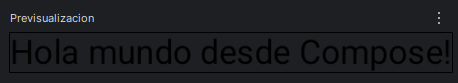
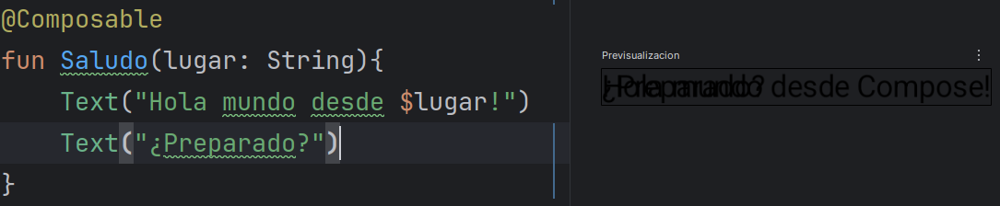
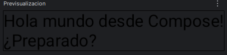

# Clases Compose

## Clase 2-10
### Creamos un MainActivity
Borramos todo excepto:
```Kotlin
package ...

import ...
        
class MainActivity : ComponentActivity() {
    override fun onCreate(savedInstanceState: Bundle?) {
        super.onCreate(savedInstanceState)
        
    }
}
```
### Para utilizar Compose agregamos setContent{} 
```Kotlin
class MainActivity : ComponentActivity() {
    override fun onCreate(savedInstanceState: Bundle?) {
        super.onCreate(savedInstanceState)
        setContent{
            
        }
    }
}
```
### Elementos Componibles
Utilizamos el elemento componible Text() para mostrar texto
```Kotlin
class MainActivity : ComponentActivity() {
    override fun onCreate(savedInstanceState: Bundle?) {
        super.onCreate(savedInstanceState)
        setContent{
            Text("Hola Mundo desde Compose!")
        }
    }
}
```

#### Creamos nuestro propio elemento componible! (@Composable)
Creamos una función llamada Saludo (PascalCase para composables) y denotamos que es un elemento componible con @Composable
Dentro de Saludo llamamos al elemento componible Text() al igual que hacíamos en el ejemplo anterior
Y por último llamamos a Saludo() desde setContent{} para que todo quede igual que antes pero con el nuevo elemento componible
```Kotlin
class MainActivity : ComponentActivity() {
    override fun onCreate(savedInstanceState: Bundle?) {
        super.onCreate(savedInstanceState)
        setContent{
            Saludo() 
        }
    }
}

@Composable
fun Saludo(){
    Text("Hola Mundo desde Compose!")
}
```

### Previsualización de elementos componibles (@Preview)

#### Previsualizar componente sin parámetros
Para previsualizar lo que hemos hecho utilizamos la anotación @Preview (solamente funciona con funciones @Composable)
```Kotlin
class MainActivity : ComponentActivity() {
    override fun onCreate(savedInstanceState: Bundle?) {
        super.onCreate(savedInstanceState)
        setContent{
            Saludo()
        }
    }
}
@Preview
@Composable
fun Saludo(){
    Text("Hola Mundo desde Compose!")
}
```

#### Previsualizar componente con parámetros
Qué pasaría si queremos agregar un parámetro a nuestro componente?
```Kotlin
class MainActivity : ComponentActivity() {
    override fun onCreate(savedInstanceState: Bundle?) {
        super.onCreate(savedInstanceState)
        setContent{
            Saludo("Compose")
        }
    }
}
@Preview // Va a tirar error ya que no sabe qué valor darle a $lugar
@Composable
fun Saludo(lugar: String){
    Text("Hola Mundo desde $lugar!")
}
```

##### Soluciones
1. Dar un valor por defecto a nuestros parámetros
```Kotlin
   @Preview
   @Composable
   fun Saludo(lugar: String = "Compose"){
   Text("Hola Mundo desde $lugar!")
   }
```
No siempre es la mejor solución ni la que buscamos!

2. Crear un elemento componible aparte para previsualizar lo que deseamos
```Kotlin
@Preview
@Composable
fun Previsualizacion(){
    Saludo("Compose")
}

@Composable
fun Saludo(lugar: String){
    Text("Hola Mundo desde $lugar!")
}
``` 
#### Resultado final


### Elementos de Layout
Si queremos agregar otro elemento Text en Saludo veremos algo como esto:


Para esto tenemos los elementos de Layout! 
Aprendamos el primero:
#### Column
```Kotlin
@Composable
fun Saludo(lugar: String) {
    Column {
        Text("Hola mundo desde $lugar!")
        Text("¿Preparado?")
    }
}
```
Resultado:


## Clase 3-10


}

@Preview(showSystemUi = true)
@Composable
fun Previsualizacion(){
Listado()
}

@Composable
fun Listado(){
val scrollState = rememberScrollState()
Column (
Modifier.verticalScroll(scrollState).fillMaxSize(),
verticalArrangement = Arrangement.Center,
horizontalAlignment = Alignment.CenterHorizontally
) {
Tarjeta()
Tarjeta()
Tarjeta()
Tarjeta()
Tarjeta()
Tarjeta()
Tarjeta()
Tarjeta()
Tarjeta()
Tarjeta()
Tarjeta()
Tarjeta()
Tarjeta()
Tarjeta()
Tarjeta()
Tarjeta()
Tarjeta()
Tarjeta()
Tarjeta()
Tarjeta()
Tarjeta()
Tarjeta()
Tarjeta()
Tarjeta()
Tarjeta()
Tarjeta()
}
}

@Composable
fun Imagen(){
Image(
painterResource(R.drawable.ic_launcher_foreground),
"Icono de Android",
modifier = Modifier.clip(CircleShape).background(Color.Green).size(60.dp)
)
}

@Composable
fun Saludo(lugar: String){
Column(
Modifier.padding(6.dp)
) {
Text("Hola Mundo desde $lugar!")
Spacer(Modifier.height(6.dp))
Text("¿Preparado?")
}
}

@Composable
fun Tarjeta(){
Row(
Modifier.padding(6.dp)
){
Imagen()
Saludo("Compose")
}
}